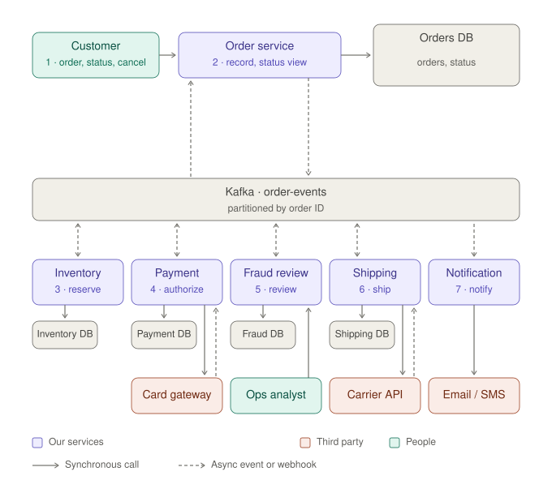
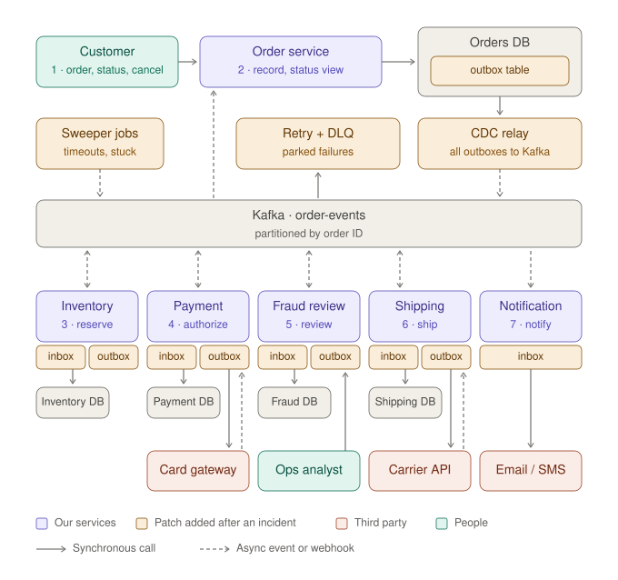
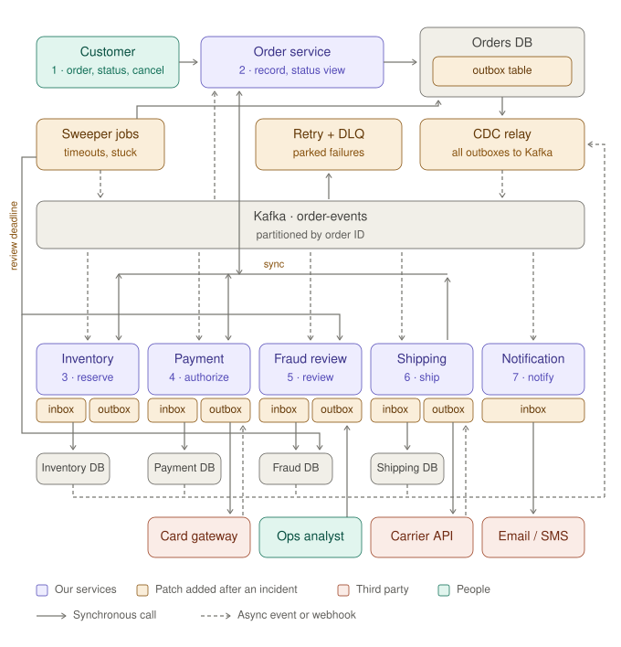
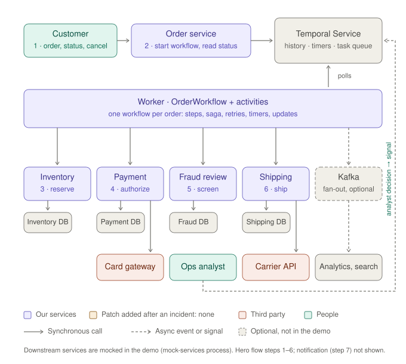

# Order System Architecture — v1 and v2 (LOCKED, rev 2)

**Use case:** E-commerce order workflow (Temporal SA technical exercise)
**Status:** 🔒 Locked · rev 23 on 2026-09-29 · v2′ locked · v1 designed · v1 scope locked
**Companion files:** `work-journal.md`, `architecture-v1.svg`, `architecture-v2.svg`

### Changelog
| Rev | Change |
|---|---|
| 1 | v1/v2 locked (Mermaid diagrams) |
| 2 | Diagrams replaced with the exact reviewed SVGs (single source of truth; Mermaid removed). Cut-in index added. **Finding 1:** v1 authorizes the card asynchronously at step 4 — that *is* the cut 6 incident; step 4 renamed "Authorize card". **Finding 2:** dual write exists in every producing service → v2 has an outbox per producing service. Retry + DLQ moved above Kafka so every consumer visibly reads from Kafka. |
| 3 | **Finding 3:** Payment, Fraud review and Shipping had no DB, yet L8 (outbox per producing service), design item E (write-then-publish) and D (payments, review cases, shipments) all assume one. Added Payment DB, Fraud DB, Shipping DB; all four service DBs now sit in one row directly under their services (Inventory DB moved out of the third-party row). Applied to **both** v1 and v2 so v2 − v1 still contains only cut-in patches. |
| 4 | **Cut 3 re-homed (option B).** Cut 3 was three incidents. Duplicates are cut 2's patch tax (the outbox relay is at-least-once; webhooks redeliver), so the **inbox moves to cut 2**. Cut 3 is now one trigger — the gateway blips at step 4 — with Problem 3's two halves: retry in place stalls the partition (lost sales → retry topics + DLQ; poison pill is the permanent case) and a timeout retry places a second hold (→ idempotency keys). Chain kept: the inbox can't protect the gateway call → leads to cut 3. |
| 5 | **Cut 7 vs. envelope.** v1 already stamps the order ID on every event (partition key), so a separate correlation ID in v1 was redundant and adding one in v2 would be a strawman. Removed from A; order ID is the correlation key. Cut 7's patch is now distributed tracing + an order timeline view. Patch tax: tracing shows what happened, not the event never published or what the order is waiting on now. Tracing backend treated as org-provided, not drawn (amber count stays 13). |
| 6 | **Cancel added to v1.** Cut 4 is a cancel racing fulfillment, but v1 had no cancel. Customer box label → "1 · order, status, cancel" (box widened to fit) in v1 and v2; hero flow gets a "Cancel order (anytime before shipment)" row. Who consumes `OrderCancelled` in v1 is decided in B (event catalog). |
| 7 | **Shipping trigger (L10).** Fraud screens every order and always emits a decision; Shipping triggers only on `ReviewApproved`. Hero flow step 5 renamed "Fraud screening". **v1 scope locked** (§9) after checking every cut-in against v1: findings 1–5 of the cut-in check resolved in revs 3–7 and the journal (cut 1/2/3 cost wording). |
| 8 | **B designed** (`v1-system-design.md`). `StockUnavailable` dropped from §9.2 B — no cut uses it. `ReviewRejected` kept (L10: Fraud always emits a decision). `OrderCancelled` is consumed by Inventory, Payment and Shipping, each reacting without checking current state (the cut 4 race). |
| 9 | **D and A/C/E designed.** Cut 3 now uses D (payment row `AUTH_PENDING`, one auth ID → orphaned first hold). **Finding 4:** with commit-after-process, the dual write loses events only at the API edge; event-driven producers get redelivery and repeated side effects instead. L8 rationale and the outbox catalog row reworded; v2 unchanged (outbox + inbox cover both). Envelope: `version` dropped (no cut uses it); event ID generated at publish time. |
| 10 | **F designed.** Cut 3's poison pill made concrete: `capture` after a lapsed hold (cut 5) returns permanent `HOLD_EXPIRED`; v1 retries every error in place → partition stuck, parcel ships unpaid. Webhooks kept minimal (drawn in the architecture; L5). Carrier `cancelBooking` exists but is never called in v1. Carrier timeout (possible double booking) not modelled — no cut uses it; parked as a discussion point. |
| 11 | **G designed.** Both write APIs answer synchronously with a promise the async system can't keep (`201 Order placed`, `200 Order cancelled`) — ties cuts 4 and 6. Cut 6's "an hour later" is explained by consumer lag / cut 3's stall, not a fixed delay. No idempotency on `POST /orders` — no cut uses it; parked as a discussion point. |
| 12 | **H designed; trace check.** Break 2 fixed: in cut 4 the cancel is published while Shipping is mid-call, so it lands before `ShipmentBooked` → Payment voids first, then capture fails with permanent `AUTH_VOIDED`, retried forever → parcel ships unpaid, partition stuck. Journal Problem 4 cost updated. Break 1 (cut 2 cost at the API edge) open. |
| 13 | **Break 1 fixed; v1 designed.** E now uses a fire-and-forget `send()` shared by every producer (client default). A hard kill before the buffer flushes loses the event at the API edge (customer holds `201`) and mid-flow (offset committed). Partly reverses Finding 4 (rev 9): Finding 4 held only under an awaited-ack setup that was assumed, not decided. L8 and the outbox catalog row reworded; journal Problem 2 now "a pod is OOM-killed or a node is lost at peak". Trace check passes: hero flow 1–6 and all 7 cuts. |
| 14 | **Cut 1 concrete** (`cut-ins.md`). Patch changed from a command chain (`PaymentVoidRequested` → `StockReleaseRequested`, which needs an orchestrator — rejected in L10) to pure choreography: each resource holder subscribes to each failure event. v2 adds `PaymentVoided`, `StockReleased`. |
| 15 | **Cut 2 concrete.** Checklist resolved: outboxes wire to the CDC relay and service ↔ Kafka arrows become consume-only (redraw batched to the v2 pass); Order service gets no inbox (a status projection tolerates duplicates; out-of-order overwrites are cut 4's row versioning — amber stays 13); sweeper reads the Orders DB (status + updated at) and re-drives by re-publishing (new `eventId` → inbox can't dedup). |
| 16 | **Cut 3 concrete.** Error classification added to the retry + DLQ patch (logic). Patch tax: retry topics break per-order ordering → leads to cut 4; cut 4's incident stays the v1 mid-call race. Journal Problem 3: orders stall rather than fail outright. |
| 17 | **Cut 4 concrete.** Patch refined: a flag check alone is still check-then-act; the race-free piece is a compare-and-set at the point of no return (booking). Checklist #3: consumers check via sync calls to the Order service (a local copy of `OrderCancelled` lags like the projection) — sync arrows Inventory/Payment/Shipping → Order service, redraw in the v2 pass; amber stays 13. v2 adds status `FULFILLING`. Temporal policy: cancel rejected once booking has started. |
| 18 | **Cut 5 concrete.** Timeout policy: auto-reject at 24h (fraud-safe; reuses cut 1 compensation); no escalation step (no cut needs it). Sweeper reads the Fraud DB and calls Fraud's reject endpoint (Fraud keeps ownership) — arrows batched to the v2 pass. `ReviewRejected` gains `mode: timeout`. Checklist #4 and #6 closed (24h ≪ ~7-day hold). |
| 19 | **Cut 6 concrete; checklist #5 closed.** Patch: synchronous reserve + authorize at checkout (`201` / `402`), chosen over "202 + polling" (the spinner would read the lagging projection). v2 event flow: Inventory stops consuming `OrderPlaced`, Payment stops consuming `StockReserved`; sync arrows Order service → Inventory, Payment (redraw in v2 pass). Client idempotency key on `POST /orders` — un-parked, since checkout timeouts make retries real. All 6 carried-over checklist items resolved. |
| 20 | **Cut 7 concrete; all cut-ins concrete.** Cut 7 traced on the patched system (v1 + cuts 1–6) because its cost grows with every patch. Order timeline lives in the Order service (`order_events` table in the Orders DB) — amber stays 13. Temporal side: custom `OrderStatus` search attribute. |
| 21 | **v2′ drawn** (`architecture-v2-prime.svg`; v2 kept for comparison). All batched path changes applied; v2′ − v1 = cut-ins re-checked in both directions (§4′). Proposed "sweeper reaches Fraud through its API only" — declined; cut 5's decision stands. |
| 22 | **v2′ locked.** Sweeper → Fraud DB read path drawn (lane between the tag row and the DB row; canvas +14px). v2′ − v1 = cut-ins holds in both directions (§4′). |
| 23 | **"After" diagram added** (`architecture-temporal.svg`, §4″): the Temporal version in the same layout as v1/v2′. Temporal Service takes the Orders DB's place; Kafka shown only as optional fan-out; amber count 0. Linked from the README. |

---

## 1. Cut-in Index

### What is a cut-in?

The presentation first walks through the **hero flow** — the happy path of one order, with nothing going wrong. A **cut-in** is a moment where the story jumps to a specific step of that flow and shows what breaks there. Each cut-in follows the same beat: **incident → the patch the team builds → why that patch breaks or adds cost → leads to the next cut-in.** The patches accumulate on the architecture, turning v1 into v2. Temporal is not mentioned until all cut-ins are told.

### The hero flow (happy path)

| Step | What happens | Performed by |
|---|---|---|
| 1 | Place order | Customer → Order service |
| 2 | Record order | Order service + Orders DB |
| 3 | Reserve stock | Inventory |
| 4 | Authorize card | Payment → Card gateway |
| 5 | Fraud screening *(every order: auto-approve low-value; analyst reviews high-value)* | Fraud review ← Ops analyst |
| 6 | Book shipment, then capture payment | Shipping → Carrier API; Payment |
| 7 | Notify customer | Notification → Email/SMS |
| — | Status check *(anytime, read-only)* | Customer → Order service |
| — | Cancel order *(anytime before shipment, customer-initiated)* | Customer → Order service |

### The index

The index is **locked**. The narrative (incident → why the patch breaks → next cut) is **pending re-derivation** after the v1 system design, because it depends on v1's precise details (event names, tables, commit timing).

| Cut | Problem | Cost rank | Hero flow step | v2 patch | Narrative |
|---|---|---|---|---|---|
| **1** | Partial failure: shipment fails after card authorized and stock reserved | 1 | 6. Book shipment | Choreographed compensation: Payment voids on `ReviewRejected`/`ShipmentFailed`; Inventory releases on `PaymentDeclined`/`ReviewRejected`/`ShipmentFailed`; results published as `PaymentVoided`/`StockReleased` | ✅ `cut-ins.md` |
| **2** | Crash mid-flow: DB write committed, event never published (dual write); orders stall | 2 | 2. Record order (and every producing service) | Outbox per producing service + CDC relay; inbox per consumer (patch tax: at-least-once delivery); sweeper for stuck orders | ✅ `cut-ins.md` |
| **3** | Gateway blips at step 4: retry in place stalls the partition (poison pill: `capture` after the hold expired returns a permanent `HOLD_EXPIRED`, retried forever — partition stuck, parcel ships unpaid; links cut 5 → cut 3); timeout retry places a second hold | 3 | 4. Authorize card | Retry topics + DLQ; idempotency keys to gateway | ✅ `cut-ins.md` |
| **4** | Cancel races fulfillment; status drifts from reality | 4 | 5. Fraud screening + status check | Fulfillment gate (compare-and-set `APPROVED → FULFILLING` on a row version, shared with the cancel API) + active-order checks (sync calls to Order service) + projection transition rules | ✅ `cut-ins.md` |
| **5** | Time rules missed: manual review never times out | 5 | 5. Fraud screening (manual queue) | Sweeper review-deadline job: reads Fraud DB, `PENDING` > 24h → Fraud's reject endpoint → `ReviewRejected (mode: timeout)` → cut 1 compensation; compare-and-set on the case | ✅ `cut-ins.md` |
| **6** | Checkout honesty: "order placed", then "payment declined" later — seconds normally, hours when consumers lag or a partition is stalled (cut 3) | 6 | 1. Place order | Synchronous checkout: Order service calls Inventory `reserve` then Payment `authorize` → `201 Order placed` or `402 Card declined`; client idempotency key on `POST /orders` | ✅ `cut-ins.md` |
| **7** | Nobody can answer "what happened to order #123?" | 7 | Whole thread | Distributed tracing (trace context propagated in Kafka headers) + order timeline view | ✅ `cut-ins.md` |

Cut-ins are presented in **business-cost order**, not flow order. The flow is a shared map; the story can cut in anywhere. Cost order also matches the patch chain and makes the story safe to truncate.

---

## 2. Role of This Architecture in the Presentation

- The **working canvas** for the cut-ins: an event-driven, Kafka-based order system, scoped to the order core.
- **v1 and v2 are two states of the same diagram.** During the cut-ins, each amber patch appears at the moment its incident happens (evolution framing).
- The **enterprise architecture** is shown at the **end** as a zoom-out: "every scar you just watched being built already exists in a real retailer" (archaeology framing). Foreshadow it in the first minute.
- The **code implements only the "after"** (Temporal version). v1 and v2 live in diagrams only.

---

## 3. v1 — As First Shipped

**Known gaps (intentional — each becomes a cut-in):**
- Every service writes its DB, then publishes to Kafka → a crash between the two loses the event (dual write).
- Consumers assume exactly-once delivery → duplicate messages and webhooks are processed twice.
- Consumers retry in place → a message that always fails blocks its partition.
- No compensation → a late failure leaves the card hold and stock reservation in place.
- No deadline enforcement → reviews wait forever; stuck orders go unnoticed.
- Card is authorized asynchronously after checkout returns → declines surface an hour later.

---

## 4. v2 — After Incidents

**The visual argument is the amber count: 4 kinds of patch, 13 amber components** (5 outboxes, 1 CDC relay, 5 inboxes, 1 retry + DLQ, 1 sweeper). The business logic is the five services; everything amber is reliability infrastructure the team now owns.

---

## 4′. v2′ — After the Concrete Cut-ins (consistency pass) — 🔒 Locked

v2 is kept unchanged for comparison. v2′ = v2 + the path changes batched during the cut-in round (`cut-ins.md`). Amber components unchanged: **13**.

### What v2′ changes vs. v2

| Change | Cut |
|---|---|
| Every service DB's outbox → CDC relay (dashed lane, right edge) | 2 |
| Kafka → service arrows consume-only (services publish only through their outbox) | 2 |
| Sweeper reads the Orders DB | 2 |
| Sweeper reads the Fraud DB (overdue `PENDING` cases) and calls the Fraud service (reject) — left lane, labelled "review deadline" | 5 |
| Sync paths: Order service ↔ Inventory, Payment (checkout; active-order checks); Shipping → Order service (fulfillment gate) | 6, 4 |
| Retry + DLQ box narrowed to make room for the sync line (cosmetic) | — |

### Re-check: v2′ − v1 = the cut-ins

**Components (amber, 13):** 5 outboxes, CDC relay, 5 inboxes, sweeper → cut 2 (sweeper also 5) · Retry + DLQ → cut 3.

**Paths:** outbox lane + CDC → Kafka, direct publish removed, consume-only arrows, sweeper → Kafka, sweeper → Orders DB → cut 2 · Kafka → Retry + DLQ → cut 3 · sync bus → cuts 4, 6 · sweeper → Fraud DB and → Fraud service → cut 5.

**Logic (not drawn):** compensation subscriptions + `PaymentVoided`/`StockReleased` → 1 · error classification, idempotency keys → 3 · `FULFILLING`, row version, transition rules → 4 · `ReviewRejected (mode: timeout)`, compare-and-set on the case → 5 · trigger moves, `402`, client idempotency key → 6 · tracing, `order_events` timeline → 7.

**Both directions hold:** every addition traces to a cut, and every cut's delta appears (drawn or as logic). ✅

## 4″. The Temporal Version (the "after")

What the code implements. Same services and third parties as v1, same positions, so the comparison with v2′ is direct:

| v2′ | Temporal version |
|---|---|
| Orders DB + outbox holds the order's state | Temporal Service holds it (event history) |
| Kafka carries every step between services | The workflow calls each step as an activity; Kafka only for optional fan-out |
| 13 amber reliability components | None |
| Sync paths into the Order service (gate, checks, checkout) | Updates and the workflow's own ordering |
| Sweeper jobs for stuck orders and deadlines | Durable timers; no silent stalls |
| Analyst → Fraud service → event | Analyst decision → signal to the workflow |

## 5. Locked Decisions

| # | Decision | Rationale |
|---|---|---|
| L1 | v1 already uses **Kafka, partitioned by order ID** | A team going event-driven starts with a broker and a sensible key; the reliability machinery comes later. Realistic, not naive. |
| L2 | v1 has **no timeout mechanism** | Review waits until an analyst acts. Clean starting point for cut 5. |
| L3 | v1 consumers **retry in place** | Default for most Kafka consumer setups — and the mechanism that lets a poison pill block a partition. |
| L4 | The **sweeper serves cuts 5 and 2** | Enforces deadlines and rescues stuck orders; orders can still stall with an outbox (e.g., consumer succeeds at the gateway, crashes before committing its offset). |
| L5 | **Webhooks go through the inbox** | Gateways and carriers redeliver webhooks; the inbox protects those entry points too. |
| L6 | **Sync at the edges, async in between** | Customer → order service and service → third party are synchronous; service ↔ service is Kafka; third parties call back via webhooks. |
| L7 | **v1 authorizes the card asynchronously at step 4**; capture happens after the shipment is booked | This async authorization *is* the cut 6 incident. "Authorize before confirming the order" is the target direction, not v1. Compensation in cut 1 is voiding an authorization (cheaper, realistic), not a refund. |
| L8 | **Outbox in every producing service** (order, inventory, payment, fraud review, shipping) | Every producing service writes, then publishes with a fire-and-forget `send()`. A hard kill before the buffer flushes loses the event in every producer — at the API edge after the customer got `201`, mid-flow after the offset was committed (cut 2). Event-driven services can also repeat side effects on redelivery, which the outbox alone does not fix; that is why the inbox comes with it. Notification only consumes, so it has an inbox only. One CDC relay publishes all outboxes. |
| L9 | **Every producing service owns a DB** (Orders, Inventory, Payment, Fraud, Shipping; Notification has none) | Precondition for the dual-write incident (cut 2) in every producing service, and home of the records cuts 1, 4, 5 read (authorization, review case, shipment). |
| L10 | **Fraud screens every order; Shipping triggers only on `ReviewApproved`** | Fraud consumes every `PaymentAuthorized`, auto-approves low-value orders, queues high-value ones for an analyst, and always emits `ReviewApproved`/`ReviewRejected` (`mode: auto \| manual`). Keeps fraud policy out of Shipping (one trigger). Realistic: retailers score every order. Cost: Fraud is on every order's critical path. Rejected: Shipping deciding by order value (policy leak); Order service routing (an orchestrator in disguise; breaks the choreography premise). |

---

## 6. What Changes Between v1 and v2

| Area | v1 · as first shipped | v2 · after incidents | Cut |
|---|---|---|---|
| **Publishing events** | Each service writes its DB, then publishes to Kafka directly (dual write). | Business row + outbox row in one transaction, in every producing service; CDC relay publishes. | 2 |
| **Duplicate messages** | Consumers assume each message arrives once. | Each consumer records processed message IDs in its inbox and skips repeats (webhooks included). | 2 |
| **Failing messages** | Retry in place; a poison pill blocks its partition. | Retry topics with backoff, then DLQ after N attempts. | 3 |
| **Deadlines and stuck orders** | Nothing enforces the 24h review deadline; stuck orders unnoticed. | Sweeper jobs scan on a schedule and emit events to move orders along. | 5, 2 |
| **Unchanged** | Services and their DBs, Kafka partitioned by order ID, sync calls to third parties, webhooks back | Same | — |

---

## 7. Patch Catalog

| Patch | Real-life picture | Fixes (incident) | Cut | What it costs the team |
|---|---|---|---|---|
| **Outbox (per producing service) + CDC relay** | You write a check and forget to mail it: your checkbook says paid, the recipient got nothing. The outbox puts the envelope in the mailbox in the same motion as writing the check. | Dual write: DB committed, service hard-killed before the fire-and-forget send flushes — downstream never hears about it (API edge and mid-flow). Earlier crashes in event-driven services redeliver the trigger instead: side effects repeat and the event is re-published with a new event ID. | 2 | Five outbox tables, a relay to deploy and monitor (e.g., Debezium), publish lag, and at-least-once delivery that creates duplicates downstream → forces the inbox. |
| **Inbox (per consumer)** | A receptionist's guest log: anyone already signed in is turned away. | Duplicates from redelivery, relay replays, consumer restarts, duplicate webhooks. | 2 | Five dedup tables + cleanup policies. Only works when the side effect is in your own DB transaction — can't cover the payment provider call, so idempotency keys are still needed. |
| **Retry topics + DLQ** | A jammed ticket at a supermarket checkout stops the whole queue; the DLQ moves that customer aside. | Poison pill blocks every order behind it on the partition. | 3 | Ordering breaks for the affected order (a later cancel gets processed while the earlier event sits in the DLQ). Someone must monitor, fix, and replay safely. |
| **Sweeper jobs** | A night guard walking a fixed route checking every door. | Missed deadlines (review timeout); orders stuck mid-flow. | 5, 2 | Time logic lives apart from flow logic; late by up to one polling interval; fails silently; needs locking to avoid double runs. |

### Patches that are logic, not components (named during their cut-ins)

| Patch | Cut |
|---|---|
| Choreographed compensation: 5 subscriptions (each resource holder subscribes to each failure event) + `PaymentVoided`, `StockReleased` events | 1 |
| Fulfillment gate (compare-and-set on a row version at the point of no return) + active-order checks via sync calls to the Order service + projection transition rules; new status `FULFILLING` | 4 |
| Idempotency keys on calls to the card gateway | 3 |
| Distributed tracing (trace context propagated in Kafka headers) + order timeline view — tracing backend is org-provided observability, not drawn | 7 |

### Discussion points
- **Partitioning by order ID** guarantees per-order ordering — and is exactly why a poison pill stalls every other order on the same partition.
- **Temporal contrast (prepare, don't present in the cut-in):** per-order isolation — a failing activity retries inside one workflow; other orders are unaffected. Honest counterpart: a stuck workflow task (e.g., non-determinism) blocks only that one workflow.

---

## 8. Mapping to the Hero Flow

| Hero flow step | Service | Cut-ins landing here |
|---|---|---|
| 1. Place order | Customer → Order service | 6 |
| 2. Record order | Order service + Orders DB | 2 |
| 3. Reserve stock | Inventory | (2 — dual write applies here too) |
| 4. **Authorize card** (renamed from "Charge card") | Payment → Card gateway | 3 |
| 5. Fraud screening | Fraud review ← Ops analyst | 4, 5 |
| 6. Book shipment (then capture payment) | Shipping → Carrier API; Payment captures | 1 |
| 7. Notify customer | Notification → Email/SMS | — |
| Whole thread | — | 7 |

---

## 9. v1 System Design Scope — 🔒 Locked (rev 7)

**Sizing principle:** v1 is sized by what the cut-in narratives need, not by how complete it looks. Necessity comes from the cut index; depth stops where each cut's incident is fully specified.

### 9.1 Cut-in scope check (what each incident needs from v1)

| Cut | Incident mechanism | v1 must contain | v2 delta | Size |
|---|---|---|---|---|
| 1 | Shipment fails; nobody voids the hold or releases the stock | B `ShipmentFailed` with no compensating consumer · D reservation, payment (auth ID, hold expiry), shipment · F gateway `void`, hold expiry; carrier error classes · H | Compensating events (logic) | M |
| 2 | DB commits, crash before publish; order sits in PLACED forever | E sequence + "same rule in every producing service" · A event ID · D order status · H | 5 outboxes, CDC relay, 5 inboxes (patch tax), sweeper | M |
| 3 | Gateway blips at step 4: retry in place stalls the partition; timeout retry places a second hold | C commit-after-process, retry in place, no dedup · A event ID, partition key · F decline vs. 5xx vs. timeout-unknown; idempotency key supported but unused · D payment row (`AUTH_PENDING`, one auth ID → orphaned first hold) · H | Retry topics + DLQ; idempotency keys (logic) | M |
| 4 | Cancel is recorded; Shipping never hears it and ships | G cancel API · B `OrderCancelled` and its v1 consumers · D status state machine, no row versioning · H | Cancel check + row versioning (logic) | M |
| 5 | Analyst never acts; order waits forever | D review case (created at, no deadline) · F analyst console · B `ReviewApproved`/`Rejected` (`mode`) · H (L2) | Sweeper | S |
| 6 | Checkout returns "placed"; decline arrives later | G place-order response · B `PaymentDeclined` → Notification · L7 | Decided in the cut-in round | S |
| 7 | State spread over 5 DBs, Kafka, logs; a lost event leaves no trace | A order ID as correlation key · H no tracing | Distributed tracing + order timeline (logic) | S |

### 9.2 Design items and depth

| Design item | Needed for cuts | Stop when |
|---|---|---|
| **A. Event envelope**: event ID, order ID (partition key; doubles as the correlation key), type, timestamp (event ID generated at publish time) | 2, 3, 7 | Each field a cut names is defined |
| **B. Event catalog**: `OrderPlaced`, `StockReserved`, `PaymentAuthorized`, `PaymentDeclined`, `ReviewApproved`, `ReviewRejected` (`mode: auto \| manual`), `ShipmentBooked`, `ShipmentFailed`, `OrderCancelled`, `PaymentCaptured` — producers and consumers (L10 routing) | All | Producer + consumers for every event a cut mentions, including who consumes `OrderCancelled` |
| **C. Topic and consumer semantics**: one topic keyed by order ID, consumer group per service, commit-after-process, retry in place, no dedup | 2, 3 | Enough to produce both the duplicate and the partition stall |
| **D. Data model**: order status state machine; reservation, payment, review case, shipment records | 1, 2, 4, 5 | States + the fields a cut reads or changes; no full schemas |
| **E. Write-then-publish sequence** | 2 | One sequence with the crash point, stated as a rule for every producing service (L8, L9) |
| **F. External contracts**: gateway (authorize, capture, void; decline / 5xx / timeout = unknown outcome; idempotency key support; webhooks; hold expiry), carrier (book; error classes; tracking webhook), analyst console | 1, 3, 5 | Operations + error classes each cut triggers |
| **G. Customer-facing APIs**: place order, get status, cancel order | 4, 6 | Request/response, including what "placed" promises |
| **H. Explicit absences**: no dedup, compensation, timeouts, outbox, DLQ, tracing, or cancel checks in consumers | All | One line per cut |

**Trace check (after H, no scope change):** trace hero flow steps 1–6 and every 9.1 cut through the design; each link names its trigger, DB write and outgoing event. Steps 1–6 are the furthest the cuts reach, so no step-7 or order-complete design is needed. Design lives in `v1-system-design.md`, written in order B → D → A/C/E → F → G → H.

**Out of scope:** notification internals, pricing and tax, stock allocation logic, auth and security, deployment, schema registry details, capacity sizing.

### Sequence of work (all done, 2026-09-29)
1. v1 system design (scoped above) — `v1-system-design.md` ✅
2. Concrete cut-ins on v1; each produces a v2 delta — `cut-ins.md` ✅
3. v2′ = v1 + deltas, one consistency pass, locked — §4′ ✅
4. The Temporal version, test-first: hero flow, then one increment per cut-in — the code and the README demos ✅
